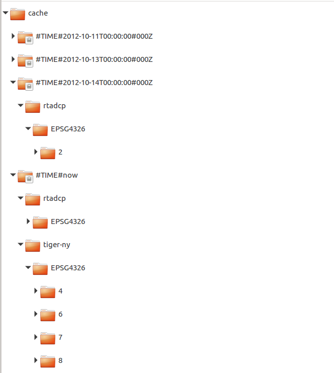

# Guide for testing Mapcache integration

We provide 2 sets of docker-compose files based on testing TIME dimension and POSTGRESQL dimension.

## Testing Mapcache with TIME dimension

### Docker-compose.yml file defines 6 services:

1. Mapcache, in front of Geoserver container and as part of an Apache2 (defined as module)
2. Memcached, used by MapCache as a memory cache level
3. Apache, which serves a couple of htmls/php files that allows to check/validate behavior on Mapcache+Memcached request. Including an OpenLayer client pointing to Mapcache.
4. Geoserver, a simple geoserver container with some information.
5. Postgres/Postgis database
6. PgAdmin, in order to get access to postgres database

### Steps

1. Run ./startup.sh script at mapcache-integration/ folder level
2. Open browser and you can try:
    1. http://localhost:8082/ol/index.html  - to get access to a OL sample that points to Mapcache with layers selector (rtadcp, Tiger-NY and Tasmania)
    2. http://localhost:8082/memcached-status.php   - you can check Memcached status (if Mapcache saved information there then you will notice it)
    3. http://localhost:8080/geoserver/web  -  you can access geoserver (admin/geoserver) with usual data_dir (but exposed in local folder so it's easy to change/look at it)
    4. http://localhost:8081/mapcache  - you will be challenging mapcache (but depending on parameters you will get or not info/tiles)
    5. http://localhost:81/ - you can access PgAdmin, with username admin@admin.com and pass 1234. There is a predefined set of servers. Postgis is the server definition that allows to connect to Postgis container, when clicking on it you will be challenged (password: docker)
3. Run ./shutdown.sh whenever you want to finish created containers

### Notes:
1. Since mapcache requires to know the container name/ip of geoserver container (internal network) you can use docker hostnames or assigned IPs (hostnames are used in docker-compose file)
2. In order to get your Docker HOSTIP, execute in console the next command   "ip a" and look for the docker0 network adapter definition. Your IP will be displayed there. Reference: https://nickjanetakis.com/blog/docker-tip-65-get-your-docker-hosts-ip-address-from-in-a-container
3. Mapcache docker image used is the one created by Camp2Camp (it can be customized creating our own Dockerfile)
4. Geoserver docker image comes from oscarfonts/geoserver dockerhub repositiory, since I could not find one available in GeosolutionsIt repo.
5. File called eumetsat.html used in combination with commented lines in eumetsat-ng-config.xml (lines 40 and 122) file (pointing to view.eumesat.int geoservers) were defined as part of testing, but unfortunatelly it's not possible to use those public servers since Mapcache is showing an error while trying to get tiles from server using CURL, showing a message related to SSL (and makes sense since EUMETSAT servers are using HTTPS)
6. File eumetsat-config.xml is the original file provided by customer.
7. If you want to test TIME dimension (ir order to generate cache folder structure based on different time dimensions values), use the following URL in browser
http://localhost:8081/mapcache/?LAYERS=rtadcp&SERVICE=WMS&VERSION=1.1.1&REQUEST=GetMap&STYLES=&FORMAT=image%2Fjpeg&SRS=EPSG%3A4326&BBOX=-160.16,48.88,-140.32,68.72&WIDTH=256&HEIGHT=256&time=2012-10-11T00:00:00.000Z

    Changing values in the parameter time="date-format".
    Then, cache folder structure will result as shown in following image: 

    

    That is:
    time-dim/tileset/grid/x/y/z/file.ext

8. Default dimension value when dimension is not defined is "now".

## Testing Mapcache with POSTGRESQL dimension enabled

It was required to create a new docker image based on the previous example, that enables Postgresql integration on Mapcache.

### Docker-compose-pg.yml file defines 6 services:

Same case as docker-compose.yml, but it's using eumetsat-ng-postgres-config.xml file at mapcache service definition, in order to declare the use of dimension postgresql.

NOTE: With mirror mode in mapcache, only 1 tileset can be defined. Then if more than one dimension is defined, our set of testing layers should match expected dimensions definition in Geoserver side. In order to simplify testing integration, we use a simple layer added into postgis and exposed into Geoserver for such purposes (rtadcp-postgis layer)

### Preconditions for running

1. It's required to create a new docker image (check Dockerfile), since postgres integration requires to rebuild mapcache code (based on the camp2camp image as root). New generated image name: geosolutionsit/mapcache:1.8-postgresql
2. Execute ./build.sh command, and then you can use ./startup-pg.sh and ./shutdown-pg.sh for running the sample for Postgres dimension integration.
3. Check that rtadcp-postgis is currently created in postgres. If it's not, you can add the layer executing this command from console (at mapcache-integration folder level)

> psql -d gis -h 172.17.0.1 -U docker -p5432 -f ./data/shp/rtadcp/rtadcp.sql

Notes: 
1. you need psql client installed.
2. you will be challenged for docker user password (pass: docker)

### Steps

1. Run ./startup-pg.sh script at mapcache-integration/ folder level
2. Open browser and you can try:
    1. http://localhost:8082/ol/index-pg.html  - to get access to a OL sample that points to Mapcache with only 1 layer at selector (rtadcp-postgis). The example adds the SOURCE dimension (Postgresql) in the layer definition with value = GEOS3 (that will force Mapcache to create tiles when navigating the sample OL app)
    2. http://localhost:8082/memcached-status.php   - you can check Memcached status (if Mapcache saved information there then you will notice it)
    3. http://localhost:8080/geoserver/web  -  you can access geoserver (admin/geoserver) with usual data_dir (but exposed in local folder so it's easy to change/look at it)
    4. http://localhost:8081/mapcache  - you will be challenging mapcache (but depending on parameters you will get or not info/tiles)
    5. http://localhost:81/ - you can access PgAdmin, with username admin@admin.com and pass 1234. There is a predefined set of servers. Postgis is the server definition that allows to connect to Postgis container, when clicking on it you will be challenged (password: docker)
3. Run ./shutdown-pg.sh whenever you want to finish created containers

### Notes:
1. You can change source dimension value in index-pg.html file, to match GEOS or GEOS2 values, but since it's mapping to more than one subdimension in our testing layer, then Mapcache will throw a warning like this:

> [Wed Oct 07 15:40:15.127334 2020] [:error] [pid 9:tid 140340539389696] [client 172.30.0.1:35246] dimension (source) for tileset (rtadcp-postgis) returned invalid number (3) of subdimensions (1 expected)

